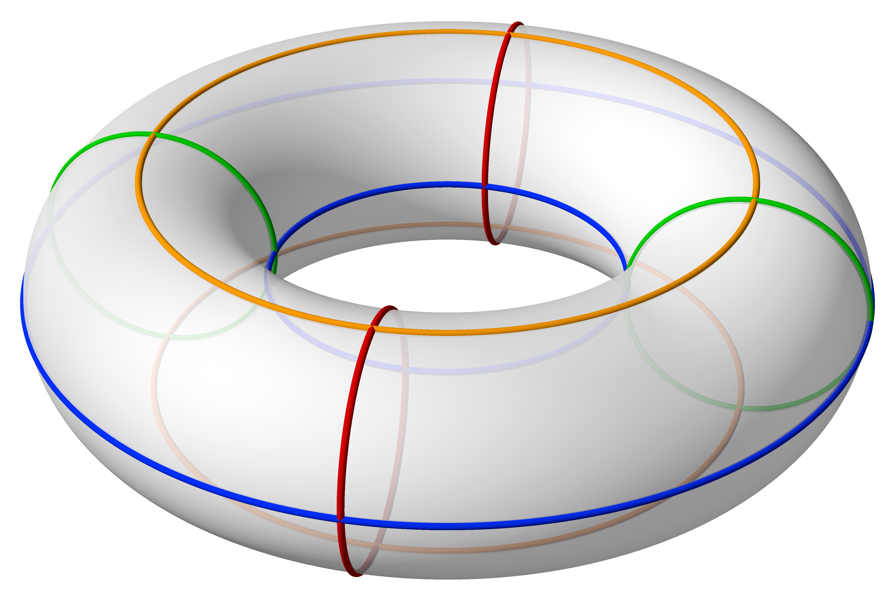
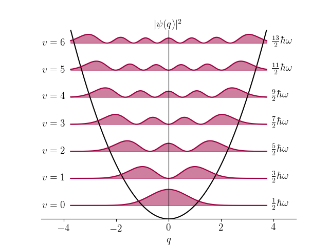
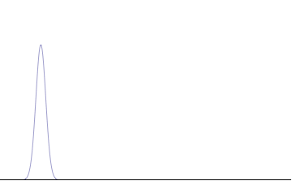
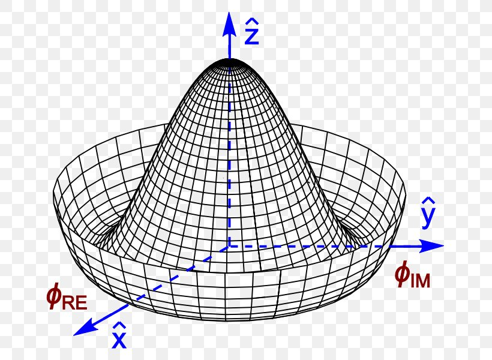
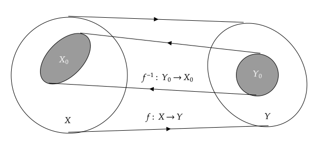

# ModuliSpaces.jl
Find, understand and visualize the moduli spaces of your favorite class of objects.
## What is a moduli space?
An isomorphic space of a class of objects, naively speaking.
### Examples
- All the possible(or an infinite number of) poison dart frogs in the world  $\to$ A subregion in the space of traits of poison dart frogs

    

- The solutions of $x^n = 1$ 
$\to$ 
$\mathbb Z_n$(any integer mod by $n$)
- All possible ways to wind a circle on a $\mathbb T^2$(Torus) 
$\to$  
$\pi(\mathbb T^2) = \mathbb Z^2$(any element that is described by two integers)

    

- Solutions of a harmonic oscillator  $\to$ A series of discrete numbers called energy spectrum, or non-negative integers $n$ denoted as particle numbers

    

- A free particle solution in quantum theory $\to$ A set of spectra in the phase space of energy, momentum, spin, charges, etc.

    

- The vacua configurations of a field theory $\to$ Some geometric objects in the space of field profiles(or VEVs(vacuum expectation values) if we assume the translational invariance of vacua)

    

### What is the point of studying moduli spaces?
Moduli spaces are motivated by **classifying**(and maybe visualizing) a bunch of complicated stuff as some **isomorphic**(i.e. of the same shape) objects.
So we can **distinguish** different classes of things by comparing their moduli spaces.
## What can I do with ModuliSpaces.jl?
### Prob the moduli spaces

    

- How to get the image of the map?
    - Function to be realized: Given a class of interested objects $Y_0$, find the corresponding parameter space $X_0$ that can parameterize all the objects in $Y_0$
    - Algorithm:
        - Prepare a large enough parameter space $X$
        - Parameterize all possible objects $Y$ by using the parameter space $X$. That is, to define an **isomorphic(one-to-one) map** $f$ from $X$ to $Y$
        - Distinguish the interested objects $Y_0$ from possible objects $Y$
        - Retrieve the inverse image(i.e. **the moduli space**) $X_0$ of the objects of interest $Y_0$
    - Implementation:
        - `f(x)->y`: A function that maps a point `x` in the parameter space $X$ to an object `y` in the space of all possible objects $Y$
        - `isa(y, Y0)->{true, false}`: A function that determines whether a given object `y` belongs to `Y0` the class of interested objects $Y_0$
        - `findfirst(f, X , x0, Y0)->X'`$\subset$`X0`: A function that scan the parameter space $X$ starting from the point $x_0$ and returns one subset $X'$ of the inverse image $X_0$ of the objects of interest $Y_0$
            - `priori_dfs(f, X, x0, Y0)->X'`:A variant of the traditional depth-first searching algorithms that incorporate different priorities for different phase space points. 
        It prioritizes the exploration of higher hierarchy phase space points, thereby optimizing the search process in hierarchical graphs.
    - Data Organization
        - `SimplexGraph`: A type that contains all necessary information of a class of objects.
            - `ParamSpace <: Graph`: A type 
        - `Element`

#### Example: Find the moduli space of the solutions of an ODE family with the Robin boundary conditions
$$
\begin{cases}
    F''(x) + a_1(x) F'(x) + a_0(x, m) F(x) = 0,\, x\in[0,1]\\
    F'(0)  + bF(0) = 0\\
    F'(1)  + cF(1) = 0

\end{cases}
$$
where $a_1(x)$ and $a_0(x, m)$ are some functions of $x$, $m$ is a free parameter to parameterize the family of this ODE, and $a$ and $b$ are some constants.
To find the moduli space of the solutions of this ODE family, we follow the algorithm above:
- Parameterize all possible solutions of this ODE family by using the parameter space $X$, where $X = \{(F'(0),m) |F'(0)\in \mathbb R,\, m\in\mathbb C\}$
    - In general, to solve a second order ODE,
- Technical Sidenotes
    - where should we start shooting?
        - In some cases, neither $y=0$ nor $y=y_m$ are not good starting points. It is because the solution $F$ contains the exponential function, which is very sensitive to the initial conditions. Therefore, the numerical error will be amplified exponentially if we do so.
        - For these cases, an optimized choice is to start from a middle point which takes the balance of exponential growth and decay into account. Practically, we can start from $\frac{y_m}{2}$ and grab a experimental solution. Then we find the maximum of the solution and use it as the starting point if it is needed.
### Understand the moduli spaces (TODO)
#### symmetries
#### topological properties
### Visualize the moduli spaces(TODO)
