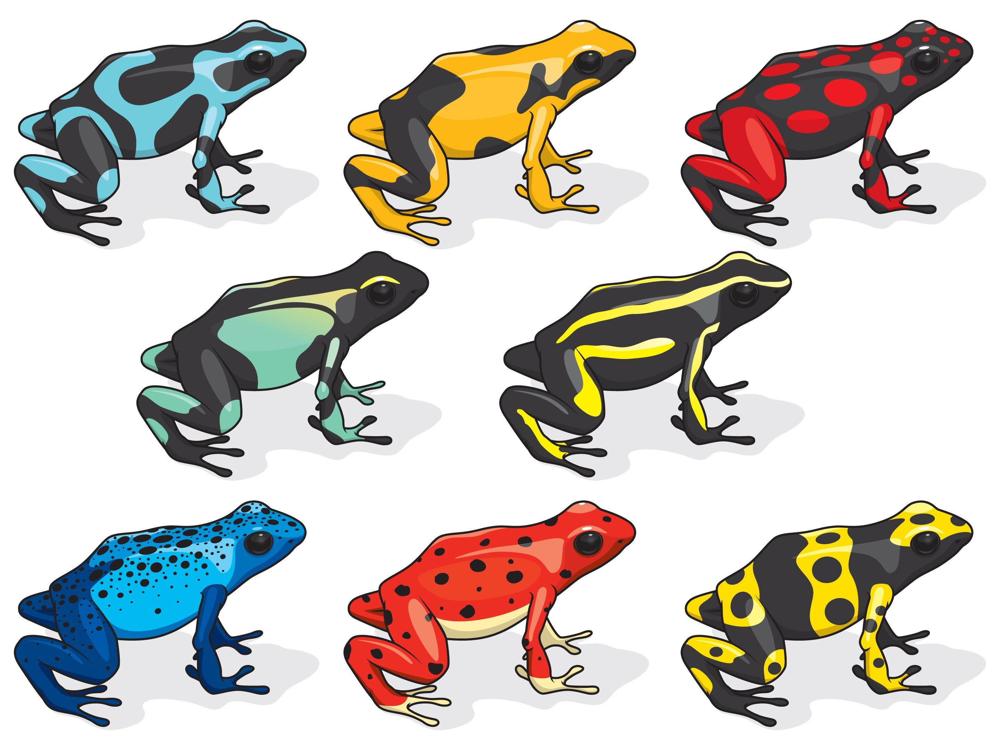

# ModuliSpaces.jl
Find, understand and visualize the moduli spaces of your favorite class of objects.
## What is a moduli space?
An isomorphic space of a class of objects, naively speaking.
### Examples
- All the possible(or an infinite number of) poison dart frogs in the world  $\to$ A hyperplane in the space of traits of poison dart frogs

    

- The solutions of $x^n = 1$ 
$\to$ 
$\mathbb Z_n$(any integer modulo $n$)
- All possible ways to wind a circle on a $\mathbb T^2$(Torus) 
$\to$  
$\pi(\mathbb T^2) = \mathbb Z^2$(two integers)
- Solutions of a harmonic oscillator  $\to$ A series of discrete numbers called energy spectrum, or non-negative integers $n$ denoted as particle numbers

    

- A free particle solution in QFT $\to$ Spectrum in the phase space of mass, spin, charges, etc.
- The vacua configurations of a field theory $\to$ Some geometric objects in the space of field profiles(or VEVs(vacuum expectation values) if we assume the translational invariance of vacua)
### What is the point of studying moduli spaces?
Moduli spaces are motivated by **classifying**(and maybe visualizing) a bunch of complicated stuff as some **isomorphic**(i.e. of the same shape) objects.
So we can **distinguish** different classes of things by comparing their moduli spaces.
## What can I do with ModuliSpaces.jl?
### Prob the moduli spaces

    

- How to get the image of the map?
    - Aim: Given a class of interested objects $Y_0$, find the corresponding parameter space $X_0$ that can parameterize all the objects in $Y_0$
    - Procedure:
        - Prepare a large enough parameter space $X$
        - Parameterize all possible objects $Y$ by using the parameter space $X$. That is, to define an **isomorphic(one-to-one) map** $f$ from $X$ to $Y$
        - Distinguish the interested objects $Y_0$ from possible objects $Y$
        - Retrieve the inverse image(i.e. **the moduli space**) $X_0$ of the objects of interest $Y_0$
    - Implementation:
        - `f(x)->y`: A function that maps a point `x` in the parameter space $X$ to an object `y` in the space of all possible objects $Y$
        - `isbelongto(y, Y0)->{true, false}`: A function that determines whether a given object `y` belongs to `Y0` the class of interested objects $Y_0$
        - `findfirst(isbelongto, f, X , x0)->X'`$\subset$`X0`: A function that scan the parameter space $X$ starting from the point $x_0$ and returns one subset $X'$ of the inverse image $X_0$ of the objects of interest $Y_0$
            - `priori_dfs(X, x0, f, isbelongto)->X'`:A variant of the traditional depth-first searching algorithms that incorporates different priorities for different phase space points. 
        It prioritizes the exploration of higher hierarchy vertices, thereby optimizing the search process in hierarchical graphs
### Understand the moduli spaces (TODO)
#### symmetries
#### topological properties
### Visualize the moduli spaces(TODO)
